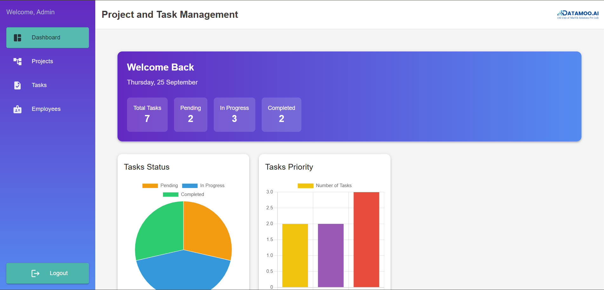
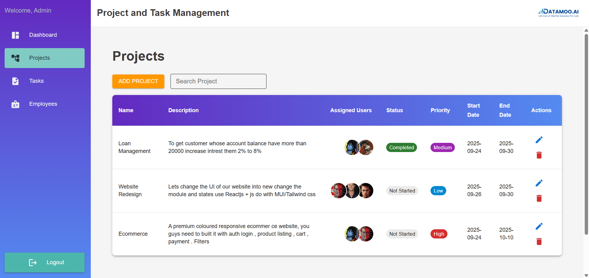
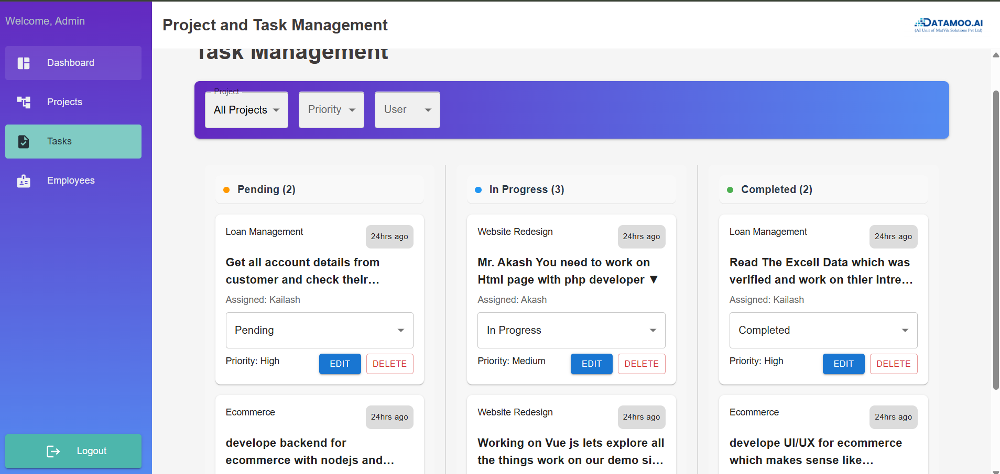
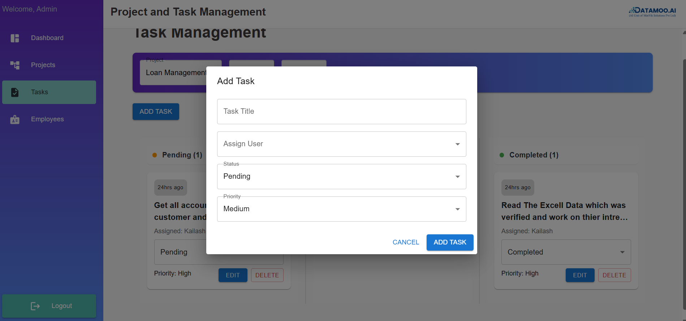
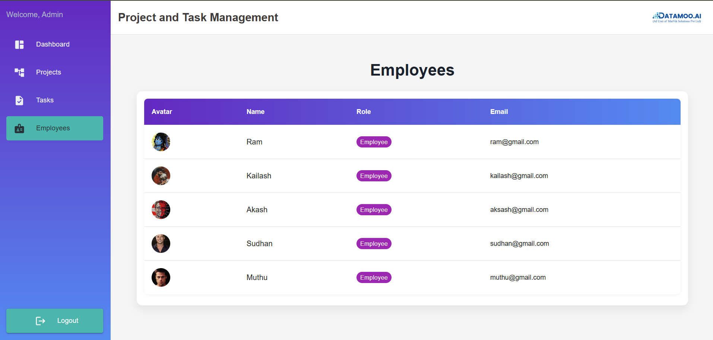

# Project-and-Task
Task Management Project

A Task Management Dashboard built with React, Redux Toolkit, and Material UI (MUI). This project allows admins to manage projects and tasks, and users to view and update their assigned tasks. 

Features

        Sidebar Navigation:
        
        Quick navigation between Dashboard (Home), Projects, Tasks, Employees, Analytics (Pie Charts).

        Dashboard/Home
            Overview of tasks, projects, and employee activity.
            Visual representation via Pie Charts.

            

        Projects:
            View, filter, and manage projects.
            Assign employees to projects.
            

        Tasks

            Kanban-style view: Pending, In Progress, Completed.
            Admin can add, edit, delete tasks.
            Users can update status of assigned tasks.
            Filters: Project, User, Status, Priority.
            
        Employees
            List of employees.
            Assign employees to projects and tasks.
            
            

        Tech Stack

            React,Redux Toolkit
            Material UI (MUI),Recharts (for Pie Charts)
            LocalStorage (for logged-in user info)

